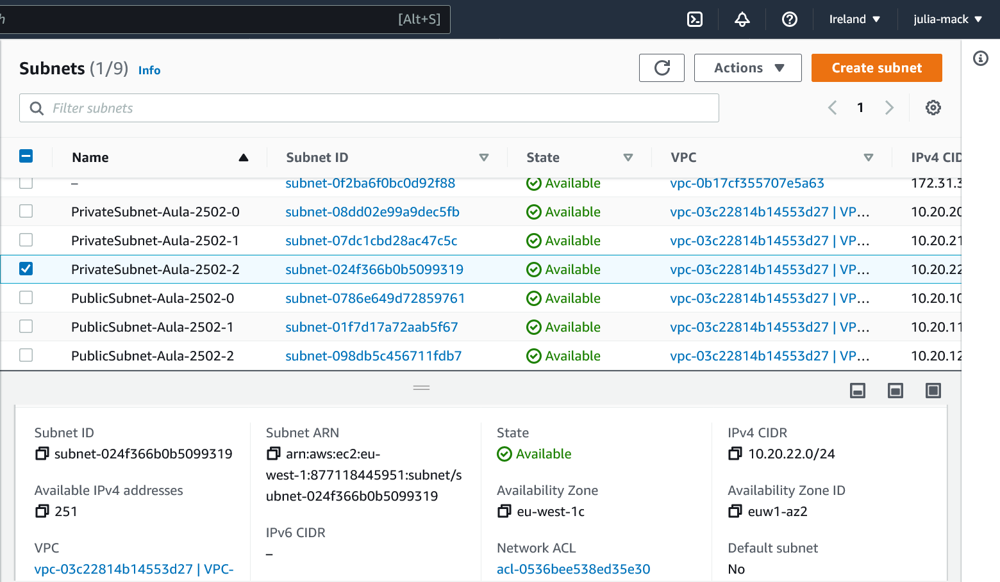

# IaC-Lab01
Laboratório - 25-02-2022

- Criar um módulo terraform que crie em multi regiões (2) os seguintes recursos:
	- VPC
	- 3 Subnets (Uma em cada AZ)
	- Internet Gateway
	- 2 Maquinas EC2  
	- 1 Banco de dados RDS PostgreSQL
	- 1 Balanceador de Carga
	- Security Group para cada recurso acima (EC2, RDS e Balanceador)


```
terraform init
terraform validate
terraform plan
terraform apply
```

### VPC
#### eu-west-1

#### eu-west-2


### Subnets
#### eu-west-1a

#### eu-west-1b

#### eu-west-1c


#### eu-west-2a

#### eu-west-2b

#### eu-west-2c


### Internet Gateway
#### eu-west-1

#### eu-west-2


### EC2
#### eu-west-1

#### eu-west-2


### RDS
#### eu-west-1


#### eu-west-2


### Load Balancer
#### eu-west-1

#### eu-west-2


### Security Groups
#### eu-west-1

#### eu-west-2
